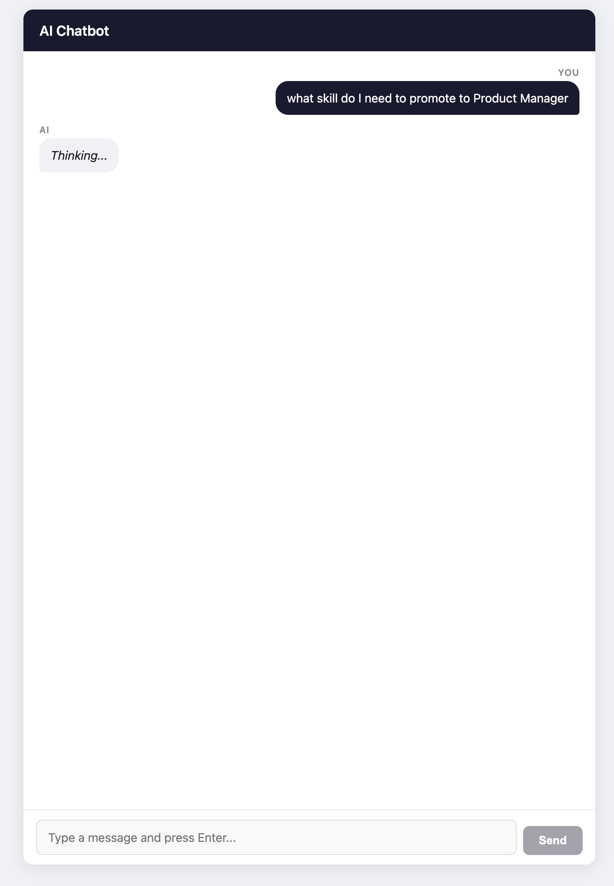
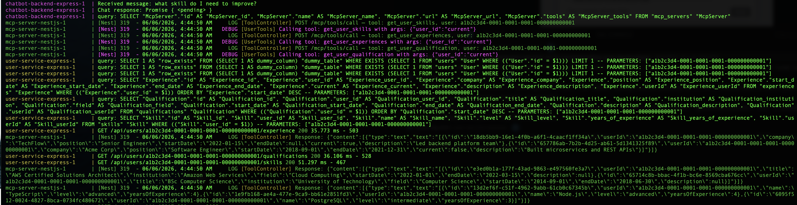
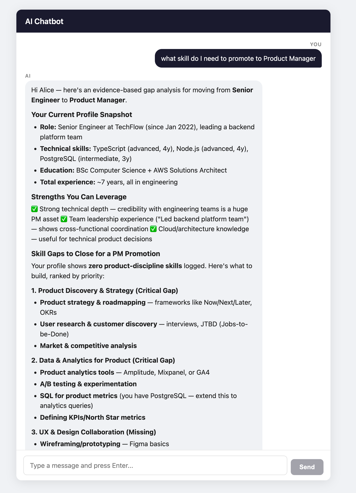

# AI Chatbot with MCP Server

A complete AI Chatbot powered by Claude LLM and the Model Context Protocol (MCP). A monorepo composed of three backend services and a web frontend, where the chatbot calls real-time tools to fetch live user data during a conversation.

## Screenshots

### Question


### Service Logs


### Answer


---

## Services at a glance

| Directory | Framework | Port | Role |
|---|---|---|---|
| `chatbot-frontend-nextjs` | Next.js 15 | 3001 | Chat UI |
| `chatbot-backend-express` | Express | 4000 | Chat API & MCP Client |
| `mcp-server-nestjs` | NestJS | 3000 | MCP Server |
| `user-service-express` | Express | 4001 | User Data API |

---

## chatbot-frontend-nextjs

**Framework:** Next.js 15 (React, TypeScript)

Single-page chatbox UI. Sends user messages to `chatbot-backend-express` via a Next.js rewrite proxy and displays the AI response in a chat interface with markdown rendering.

- **Port:** 3001
- **Proxies:** `/api/*` → `chatbot-backend-express:4000`

---

## chatbot-backend-express

**Framework:** Express (TypeScript, routing-controllers, tsyringe, TypeORM)

Chat API that drives a tool-calling loop with the Anthropic Claude API. Acts as an MCP Client — when Claude decides to call a tool, this service forwards the request to `mcp-server-nestjs` with the user's execution context. Persists conversation data in PostgreSQL.

- **Port:** 4000
- **Database:** PostgreSQL — `chatbot-backend-db` (host port 5433)
- **Endpoints:**
  - `POST /api/chat` — send a message, receive an AI reply
  - `GET /api/health` — health check

#### `POST /api/chat`

Request:
```json
{
  "message": "What are my skills?",
  "execution_context": {
    "user_id": "a1b2c3d4-0001-0001-0001-000000000001",
    "roles": ["employee"]
  }
}
```

> `execution_context` is optional. If omitted, a default context is used.

Response:
```json
{
  "reply": "Based on your profile, you have the following skills:\n\n- **TypeScript** — intermediate level\n- **Node.js** — intermediate level\n- **PostgreSQL** — intermediate level"
}
```

#### `GET /api/health`

Response:
```json
{
  "status": "ok",
  "timestamp": "2024-01-15T10:00:00.000Z",
  "database": "connected"
}
```

---

## mcp-server-nestjs

**Framework:** NestJS (TypeScript, `@modelcontextprotocol/sdk`)

MCP Server that exposes tools for the chatbot backend to call. Each tool fetches live data from `user-service-express` using the `user_id` from the execution context — the LLM never supplies the user ID directly.

- **Port:** 3000
- **Endpoints:**
  - `GET /health` — health check
  - `GET /mcp/tools` — list all available user tools
  - `POST /mcp/tools/call` — invoke a tool by name with an execution context

#### `GET /health`

Response:
```json
{ "status": "ok" }
```

#### `GET /mcp/tools` response

```json
{
  "tools": [
    {
      "name": "get_user_profile",
      "description": "Retrieve the current user's profile including name, email, bio, and avatar",
      "inputSchema": {
        "type": "object",
        "properties": {}
      }
    },
    {
      "name": "get_user_skills",
      "description": "Retrieve the current user's skills including skill level and years of experience",
      "inputSchema": {
        "type": "object",
        "properties": {}
      }
    },
    {
      "name": "get_user_experiences",
      "description": "Retrieve the current user's work experience history",
      "inputSchema": {
        "type": "object",
        "properties": {}
      }
    },
    {
      "name": "get_user_qualification",
      "description": "Retrieve the current user's academic and professional qualifications",
      "inputSchema": {
        "type": "object",
        "properties": {}
      }
    }
  ]
}
```

#### `POST /mcp/tools/call`

All requests share the same envelope. The `tool_call.name` selects which tool to run, and `execution_context.user_id` identifies the target user.

**`get_user_profile`**

Request:
```json
{
  "tool_call": {
    "name": "get_user_profile",
    "arguments": {}
  },
  "execution_context": {
    "user_id": "a1b2c3d4-0001-0001-0001-000000000001",
    "roles": ["employee"]
  }
}
```

Response:
```json
{
  "content": [
    {
      "type": "text",
      "text": "{\"id\":\"a1b2c3d4-0001-0001-0001-000000000001\",\"name\":\"Alice Nguyen\",\"email\":\"alice.nguyen@example.com\",\"bio\":null,\"avatar\":null}"
    }
  ]
}
```

**`get_user_skills`**

Request:
```json
{
  "tool_call": {
    "name": "get_user_skills",
    "arguments": {}
  },
  "execution_context": {
    "user_id": "a1b2c3d4-0001-0001-0001-000000000001",
    "roles": ["employee"]
  }
}
```

Response:
```json
{
  "content": [
    {
      "type": "text",
      "text": "[{\"id\":\"e1a2b3c4-0001-0001-0001-000000000001\",\"userId\":\"a1b2c3d4-0001-0001-0001-000000000001\",\"name\":\"TypeScript\",\"level\":\"intermediate\",\"yearsOfExperience\":null}]"
    }
  ]
}
```

**`get_user_experiences`**

Request:
```json
{
  "tool_call": {
    "name": "get_user_experiences",
    "arguments": {}
  },
  "execution_context": {
    "user_id": "a1b2c3d4-0001-0001-0001-000000000001",
    "roles": ["employee"]
  }
}
```

Response:
```json
{
  "content": [
    {
      "type": "text",
      "text": "[{\"id\":\"d1a2b3c4-0001-0001-0001-000000000001\",\"userId\":\"a1b2c3d4-0001-0001-0001-000000000001\",\"company\":\"Acme Corp\",\"position\":\"Software Engineer\",\"startDate\":\"2018-09-01\",\"endDate\":\"2021-12-31\",\"current\":false,\"description\":\"Built microservices and REST APIs\"}]"
    }
  ]
}
```

**`get_user_qualification`**

Request:
```json
{
  "tool_call": {
    "name": "get_user_qualification",
    "arguments": {}
  },
  "execution_context": {
    "user_id": "a1b2c3d4-0001-0001-0001-000000000001",
    "roles": ["employee"]
  }
}
```

Response:
```json
{
  "content": [
    {
      "type": "text",
      "text": "[{\"id\":\"f1a2b3c4-0001-0001-0001-000000000001\",\"userId\":\"a1b2c3d4-0001-0001-0001-000000000001\",\"title\":\"BSc Computer Science\",\"institution\":\"University of Technology\",\"field\":null,\"startDate\":\"2018-06-30\",\"endDate\":null,\"description\":null}]"
    }
  ]
}
```

---

## user-service-express

**Framework:** Express (TypeScript, routing-controllers, tsyringe, TypeORM)

REST API that manages user profiles, skills, qualifications, and work experience, backed by PostgreSQL.

- **Port:** 4001
- **Database:** PostgreSQL — `user-service-db` (host port 5432)
- **Endpoints:**
  - `GET /api/health` — health check
  - `GET /api/users/:id/profile`
  - `GET /api/users/:id/skills`
  - `GET /api/users/:id/qualifications`
  - `GET /api/users/:id/experience`

Seed user IDs for testing:
- Alice Nguyen — `a1b2c3d4-0001-0001-0001-000000000001`
- Bob Smith — `a1b2c3d4-0002-0002-0002-000000000002`

#### `GET /api/health`

Response:
```json
{
  "status": "ok",
  "timestamp": "2024-01-15T10:00:00.000Z",
  "database": "connected"
}
```

#### `GET /api/users/:id/profile`

```json
{
  "id": "a1b2c3d4-0001-0001-0001-000000000001",
  "firstName": "Alice",
  "lastName": "Nguyen",
  "email": "alice.nguyen@example.com",
  "bio": null,
  "avatarUrl": null,
  "createdAt": "2024-01-15T10:00:00.000Z",
  "updatedAt": "2024-01-15T10:00:00.000Z"
}
```

#### `GET /api/users/:id/skills`

```json
[
  {
    "id": "e1a2b3c4-0001-0001-0001-000000000001",
    "userId": "a1b2c3d4-0001-0001-0001-000000000001",
    "name": "TypeScript",
    "level": "intermediate",
    "yearsOfExperience": null
  },
  {
    "id": "e1a2b3c4-0002-0002-0002-000000000002",
    "userId": "a1b2c3d4-0001-0001-0001-000000000001",
    "name": "Node.js",
    "level": "intermediate",
    "yearsOfExperience": null
  },
  {
    "id": "e1a2b3c4-0003-0003-0003-000000000003",
    "userId": "a1b2c3d4-0001-0001-0001-000000000001",
    "name": "PostgreSQL",
    "level": "intermediate",
    "yearsOfExperience": null
  }
]
```

#### `GET /api/users/:id/qualifications`

```json
[
  {
    "id": "f1a2b3c4-0001-0001-0001-000000000001",
    "userId": "a1b2c3d4-0001-0001-0001-000000000001",
    "title": "BSc Computer Science",
    "institution": "University of Technology",
    "field": null,
    "startDate": "2018-06-30",
    "endDate": null,
    "description": null
  },
  {
    "id": "f1a2b3c4-0002-0002-0002-000000000002",
    "userId": "a1b2c3d4-0001-0001-0001-000000000001",
    "title": "AWS Certified Solutions Architect",
    "institution": "Amazon Web Services",
    "field": null,
    "startDate": "2022-03-15",
    "endDate": null,
    "description": null
  }
]
```

#### `GET /api/users/:id/experience`

```json
[
  {
    "id": "d1a2b3c4-0001-0001-0001-000000000001",
    "userId": "a1b2c3d4-0001-0001-0001-000000000001",
    "company": "Acme Corp",
    "position": "Software Engineer",
    "startDate": "2018-09-01",
    "endDate": "2021-12-31",
    "current": false,
    "description": "Built microservices and REST APIs"
  },
  {
    "id": "d1a2b3c4-0002-0002-0002-000000000002",
    "userId": "a1b2c3d4-0001-0001-0001-000000000001",
    "company": "TechFlow",
    "position": "Senior Engineer",
    "startDate": "2022-01-15",
    "endDate": null,
    "current": true,
    "description": "Led backend platform team"
  }
]
```

---

## Running with Docker Compose

```bash
# Build and start all services
docker compose up --build

# Detached mode
docker compose up --build -d

# Stop everything
docker compose down

# Tail logs for one service
docker compose logs -f <service-name>
```

Service URLs once running:

| Service | URL |
|---|---|
| mcp-server-nestjs | http://localhost:3000 |
| chatbot-frontend-nextjs | http://localhost:3001 |
| chatbot-backend-express | http://localhost:4000 |
| user-service-express | http://localhost:4001 |

## Running migrations locally

Migrations use TypeORM and run from each service's directory (requires local Node, not Docker).

### user-service-express

```bash
cd user-service-express
npm install
npm run migration:run
```

### Common commands

```bash
npm run migration:revert
npm run migration:generate -- src/database/migrations/<MigrationName>
```

> **Note:** Ensure your `.env` or environment variables match the values in `docker-compose.yml` before running migrations locally.
